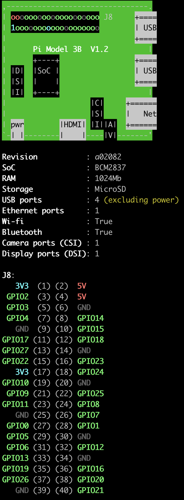

# Pi4JDevices Library
Java Library to use several sensors/actors for RaspberryPi based on [Pi4J framework](https://pi4j.com/1.2/index.html).

Following devices (sensors & actors) are included currently
* I2C - Devices
  * VCNL4000    (proximity sensor)
  * ADS10x15    (4-channel analog -> digital converter)
  * ADXL345     (3-axis accelerometer with 13-bit resolution) 
  * MPU-6050    (3-axis accelerometer and 3-axis gyro 16-bit sensor)
  * MPL115A2    (Pressure/Temperature Sensor)
  * SSD1306     (OLED display)
  * LCD         (2x20 character LCD display)
  * LED Matrix  (8x8 LED matrix)
* UART (serial connection)
  * RFID        (RFID reading based on serial communication)
* GPIO
  * Turn on/off LED (pin-number)
  * Switch      (input pin-number)
  
### Pin Layout
#### Determine your RaspberryPi model and Pin layout
In order to use the correct pin layout and mapping determine the hardware model first.
Open a terminal on the raspi and enter
```
cat /sys/firmware/devicetree/base/model
```
The output will look something like this
```
>> Raspberry Pi 3 Model B Rev 1.2
```
Refer to (https://pinout.xyz/) to get the corresponding pin layout.

#### GPIO-Zero
An direct and easier way is to install the support library [GPIO-Zero](https://gpiozero.readthedocs.io/en/stable/installing.html)
and run the command
```
pinout
```
which will return the hardware model and the current pin states and layout in one step



```
Maximum Current !
Raspberry Pi GPIOs shall not exceed 50mA in summary ! 
Max current of an single GPIO shall not exceed 16mA. Working mode of an single GPIO is between 3..8mA.
```

### Setup steps after raw image installation
After a fresh installation make sure to setup the following steps in order to run the library properly
#### Configuration
After first boot up do the following Initial configuration of RaspberryPi
```
sudo raspi-config
```
Open point 'Interface Options', and enable the following interfaces
*	SSH login
* SPI Bus support
* I2C Bus support
* 1-wire support

Open point 'Advanced Options', and disable the following interfaces to ensure RFID-Reader via serial port works later on.
* Disable login shell over serial

Additionally, configure network options like WLAN settings, localization options like keyboard layout, timezone, etc. up to your needs.
Also, it is recommended to change the default password for the user “pi”, as well as the hostname.

#### Install required software and libraries

__Install Java__
```
sudo apt-get install openjdk-11-jdk
```
__WiringPi__
```
sudo apt-get install wiringpi
```
__Python package Manager__
```
sudo apt-get install python-pip
```
__Python package for “Serial” installieren__
```
sudo pip install pyserial
```
__MQTT Client__
```
sudo apt-get install -y mosquitto mosquitto-clients
```
__MQTT Python libraries__
```
sudo pip install paho-mqtt
```
## Usage
### LED
Good introduction in how to use Raspberry Pi GPIOs, e.g. calculate max. current and resistant for LED usage, please refer to: https://www.elektronik-kompendium.de/sites/raspberry-pi/2102181.htm.

Basic Calculation based on the picture below:
* GPIO output Uges= 3.3V
  * GPIO max current 16mA; permanent current better be 3..5 mA
* RED LED voltage UF= 1.2 V
  * Resistant voltage Urv = 2.1 V at 4.4mA -> 470 Ohm


### Switch
### RFID
#### RDM630
#### RC522


